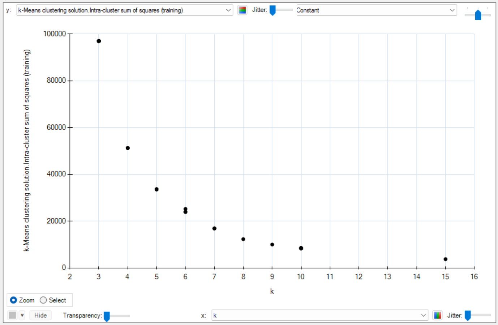

# dmml-beer

## General

We analyze the beer data set to apply things we learned during data mining and machine learning.

Our starting task is to build a beer recommendation engine. We want to cluster the beers by their aroma attributes and join the overall score of the beer to the results. So, if someone likes beer `X`, we are able to recommend similar tasting beers to him.

## Aroma attributes

In the provided list of attributes, the following attributes are related to aroma:

1. A_malt_all: Overall malt aroma
2. A_malt_grain: Grainy malt aroma
3. A_malt_bread: Bready malt aroma
4. A_malt_cara: Caramel malt aroma
5. A_malt_burn: Burnt malt aroma
6. A_hops_all: Overall hops aroma
7. A_hops_citrus: Citrusy hops aroma
8. A_hops_tropical: Tropical hops aroma
9. A_hops_noble: Noble hops aroma
10. A_hops_woody: Woody hops aroma
11. A_esters_all: Overall esters aroma
12. A_esters_ethac: Ethyl acetate esters aroma
13. A_esters_isoaa: Isoamyl acetate esters aroma
14. A_esters_flower: Floral esters aroma
15. A_esters_fruity: Fruity esters aroma

These attributes starting with "A_" specifically describe the aroma characteristics of the beer, including malt, hops, and esters aromas.

The attributes starting with "F_" (e.g., F_malt_all, F_hops_all, F_esters_all) likely represent the flavor or taste attributes of the beer, which are different from aroma.

## Clustering

At first we experiment with heuristic lab and k mean. Then we were able to create our first clusters with the desired target variables.

Now we want to find the right cluster size. For this we are using the elbow method.

Elbow Method:

- Run k-means clustering on the data for a range of k values (e.g., 1 to 10).
- For each k, calculate the sum of squared distances between data points and their cluster centroid (inertia or within-cluster sum of squares).
- Plot the inertia against the number of clusters k.
- Look for the "elbow point" in the plot where the rate of decrease in inertia slows down significantly.
- Choose the k value at the elbow point as the optimal number of clusters.

The results are plotted with heuristic lab:

We choose a cluster size of 8.

## Questions

Interesting questions which arose during the study:

- Does clustering by aroma correlate to the type of beer (like pale ale etc.?