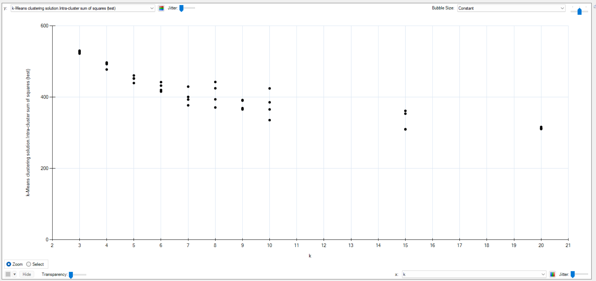
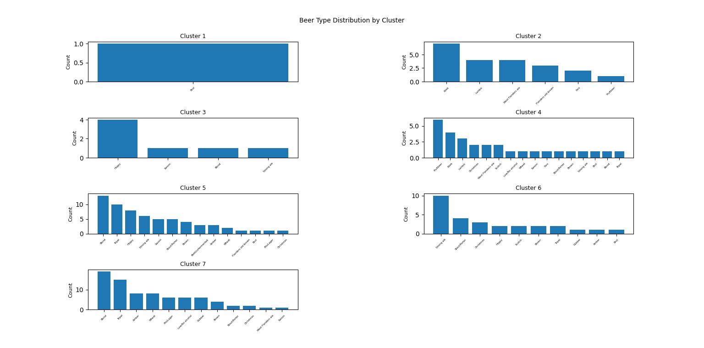
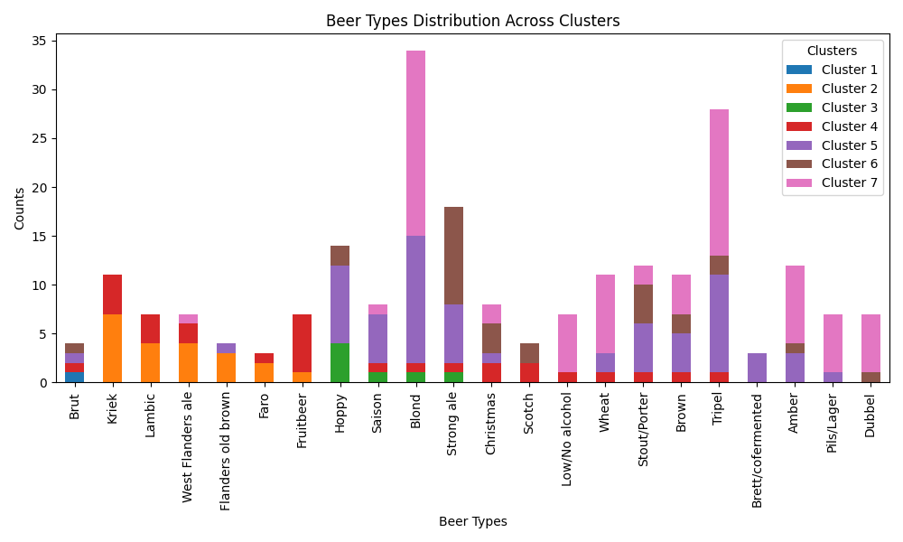
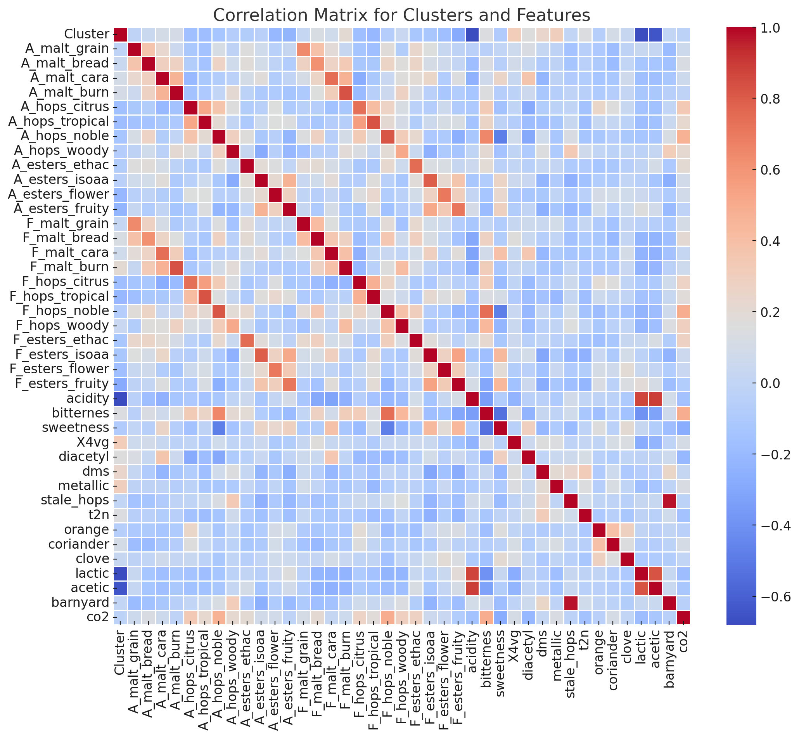

# dmml-beer

## General

We analyze the beer data set to apply things we learned during data mining and machine learning.

Our starting task is to build a beer recommendation engine. We want to cluster the beers by their aroma attributes and join the overall score of the beer to the results. So, if someone likes beer `X`, we are able to recommend similar tasting beers to him.

## Aroma attributes

After analyzing the data set 7 and reading the paper, we will use following attributes to categorize beers by their taste. We removed all cumulated attributes.

- A_malt_grain
- A_malt_bread
- A_malt_cara
- A_malt_burn
- A_hops_citrus
- A_hops_tropical
- A_hops_noble
- A_hops_woody
- A_esters_ethac
- A_esters_isoaa
- A_esters_flower
- A_esters_fruity
- F_malt_grain
- F_malt_bread
- F_malt_cara
- F_malt_burn
- F_hops_citrus
- F_hops_tropical
- F_hops_noble
- F_hops_woody
- F_esters_ethac
- F_esters_isoaa
- F_esters_flower
- F_esters_fruity
- acidity
- bitternes
- sweetness
- X4vg
- diacetyl
- dms
- metallic
- stale_hops
- t2n
- orange
- coriander
- clove
- lactic
- acetic
- barnyard
- aftertaste
- co2

## Clustering

At first we experiment with heuristic lab and k mean. Then we were able to create our first clusters with the desired target variables.

Now we want to find the right cluster size. For this we are using the elbow method.

Elbow Method:

- Run k-means clustering on the data for a range of k values (e.g., 1 to 10).
- For each k, calculate the sum of squared distances between data points and their cluster centroid (inertia or within-cluster sum of squares).
- Plot the inertia against the number of clusters k.
- Look for the "elbow point" in the plot where the rate of decrease in inertia slows down significantly.
- Choose the k value at the elbow point as the optimal number of clusters.

The results of multiple runs _(statistic relevance)_ are plotted with heuristic lab:

We choose a cluster size of 7.

## Creating our result

The we preceded by creating a data set of the clustering result + beer_id + beer_type.

Now we can take a look if the clusters are similar to the beer types.

## Cluster analyze

To calculate the percentage of beer types that are in the same cluster, we can follow these steps:

1. For each cluster, we count the number of beers per beer type.
2. We determine the most common beer type in each cluster.
3. We sum the number of beers of the most common type across all clusters and divide it by the total number of beers.

Here is the calculation for each cluster:

Cluster 1:
1 Brut (100%)

Cluster 2:
7 Kriek, 4 Lambic, 4 West Flanders ale, 3 Flanders old brown, 2 Faro, 1 Fruitbeer (33% Kriek)

Cluster 3:
4 Hoppy, 1 Saison, 1 Blond, 1 Strong ale (57% Hoppy)

Cluster 4:
6 Fruitbeer, 4 Kriek, 3 Lambic, 2 Christmas, 2 West Flanders ale, 2 Scotch, 1 Low/No alcohol, 1 Wheat, 1 Saison, 1 Faro, 1 Stout/Porter, 1 Brown, 1 Strong ale, 1 Brut, 1 Blond, 1 Tripel (23% Fruitbeer)

Cluster 5:
13 Blond, 10 Tripel, 8 Hoppy, 6 Strong ale, 5 Saison, 5 Stout/Porter, 4 Brown, 3 Brett/cofermented, 3 Amber, 2 Wheat, 1 Flanders old brown, 1 Brut, 1 Pils/Lager, 1 Christmas (21% Blond)

Cluster 6:
10 Strong ale, 4 Stout/Porter, 3 Christmas, 2 Hoppy, 2 Scotch, 2 Brown, 2 Tripel, 1 Dubbel, 1 Amber, 1 Brut (36% Strong ale)

Cluster 7:
19 Blond, 15 Tripel, 8 Amber, 8 Wheat, 6 Pils/Lager, 6 Low/No alcohol, 6 Dubbel, 4 Brown, 2 Stout/Porter, 2 Christmas, 1 West Flanders ale, 1 Saison (21% Blond)

In total, 84 out of 250 beers (34%) are of the most common type in their respective cluster.

The calculation shows that the same beer types tend to be in different clusters. Only about one-third of the beers are of the most common type in their cluster. The clustering does not seem to strongly correlate with the beer types.

To analyze the correlations between beer types and clusters, I'll look at the distribution of beer types within each cluster and identify any notable patterns or relationships.

1. Cluster 1 consists entirely of Brut beers, suggesting a strong correlation between the Brut beer type and this cluster.

2. Cluster 2 is dominated by Kriek, Lambic, West Flanders ale, and Flanders old brown beers. These beer types are related to Belgian sour ales, indicating a correlation between this cluster and sour or funky beer styles.

3. Cluster 3 has a majority of Hoppy beers, with a few other types mixed in. This suggests a moderate correlation between hoppy beers and this cluster.

4. Cluster 4 is quite diverse, with Fruitbeer being the most common type, followed by Kriek and Lambic. The presence of fruit-related and sour beer types hints at a possible correlation, but the variety of other beer types makes the relationship less clear.

5. Cluster 5 has a strong representation of Blond, Tripel, Hoppy, and Strong ale beers. This cluster seems to be associated with Belgian-style ales and hoppy beers, indicating a correlation between these beer types and the cluster.

6. Cluster 6 is primarily composed of Strong ales, with a mix of other beer types like Stout/Porter, Christmas, and Hoppy beers. The dominance of Strong ales suggests a correlation, but the presence of various other types makes the relationship less pronounced.

7. Cluster 7 has a high number of Blond and Tripel beers, followed by Amber, Wheat, and Pils/Lager. This cluster appears to be correlated with Belgian-style ales, particularly Blond and Tripel, as well as a variety of other beer types.

Overall, some clusters show strong correlations with specific beer types, such as Cluster 1 with Brut and Cluster 2 with sour/funky beers. Other clusters, like Cluster 5 and Cluster 7, have a mix of beer types but still exhibit correlations with certain styles, such as Belgian ales. Clusters 4 and 6 have a more diverse range of beer types, making the correlations less apparent.

It's important to note that while these observations suggest correlations, further statistical analysis would be needed to quantify the strength and significance of these relationships. Additionally, exploring the underlying factors that contribute to the clustering, such as flavor profiles or brewing techniques, could provide deeper insights into the observed correlations.

## Questions

Interesting questions which arose during the study:

- Does clustering by aroma correlate to the type of beer (like pale ale etc.?

  - In total, 84 out of 250 beers (34%) are of the most common type in their respective cluster.

    The calculation shows that the same beer types tend to be in different clusters. Only about one-third of the beers are of the most common type in their cluster. The clustering does not seem to strongly correlate with the beer types.