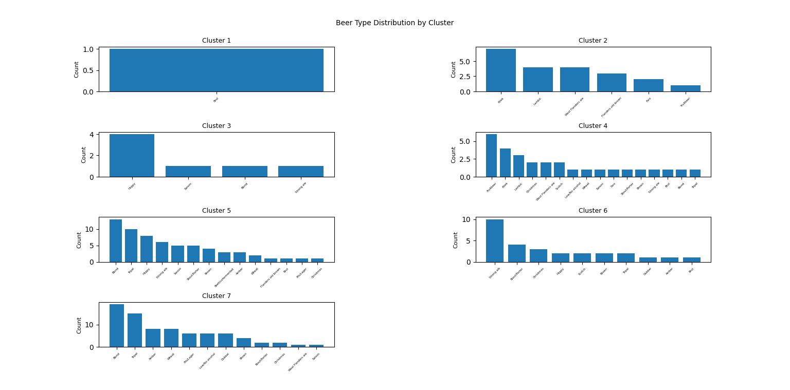
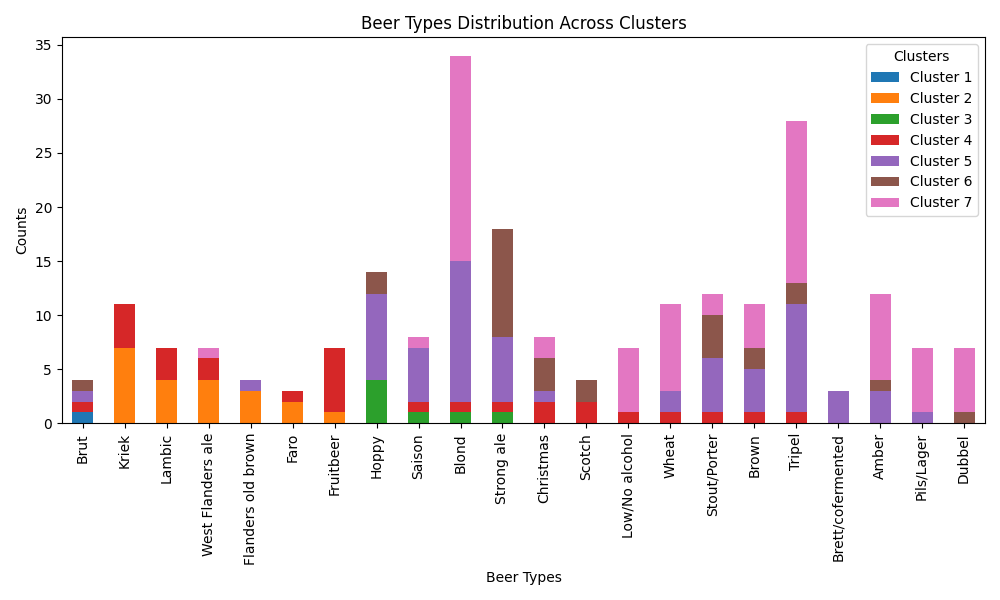
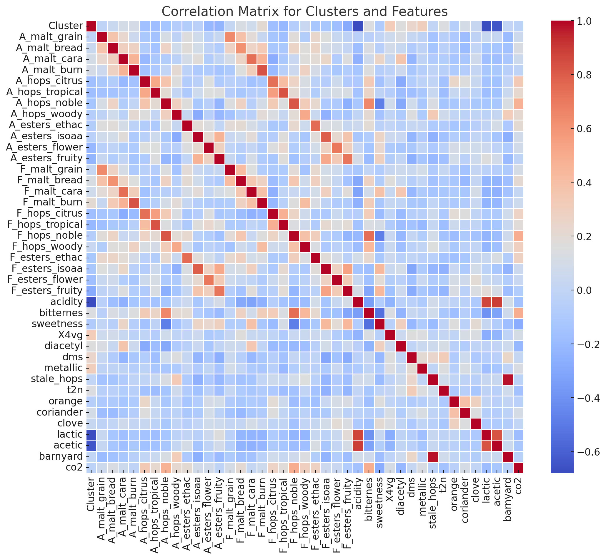

# Beer Recommendation Engine

## Clustering Beers by Aroma Attributes

---

## Aroma Attributes Used for Clustering

- A_malt_grain, A_malt_bread, A_malt_cara, A_malt_burn
- A_hops_citrus, A_hops_tropical, A_hops_noble, A_hops_woody
- A_esters_ethac, A_esters_isoaa, A_esters_flower, A_esters_fruity
- F_malt_grain, F_malt_bread, F_malt_cara, F_malt_burn
- F_hops_citrus, F_hops_tropical, F_hops_noble, F_hops_woody
- F_esters_ethac, F_esters_isoaa, F_esters_flower, F_esters_fruity
- acidity, bitternes, sweetness, X4vg
- diacetyl, dms, metallic, stale_hops, t2n
- orange, coriander, clove, lactic
- acetic, barnyard, aftertaste, co2

---

## Clustering Method

- Experimented with heuristic lab and k-means
- Used elbow method to determine optimal number of clusters
- Chose a cluster size of 7

---

## Cluster Analysis

- Calculated percentage of beer types in the same cluster
- Most common beer type per cluster:
 - Cluster 1: 100% Brut
 - Cluster 2: 33% Kriek
 - Cluster 3: 57% Hoppy
 - Cluster 4: 23% Fruitbeer
 - Cluster 5: 21% Blond
 - Cluster 6: 36% Strong ale
 - Cluster 7: 21% Blond

- In total, 34% of beers are of the most common type in their cluster
- Clustering does not strongly correlate with beer types

---

## Cluster Visualization

---

## Cluster Visualization (Stacked Bar)

---

## Output

---

## Correlations between Beer Types and Clusters

- Cluster 1: Strong correlation with Brut
- Cluster 2: Correlation with sour/funky beer styles
- Cluster 3: Moderate correlation with Hoppy beers
- Cluster 4: Possible correlation with fruit-related and sour beers
- Cluster 5: Correlation with Belgian-style ales and hoppy beers
- Cluster 6: Correlation with Strong ales, but mixed with other types
- Cluster 7: Correlation with Belgian-style ales (Blond and Tripel)

Further statistical analysis needed to quantify strength and significance of relationships.

---

## Interesting Questions

- Does clustering by aroma correlate to the type of beer?
 - Only about one-third of beers are of the most common type in their cluster
 - Clustering does not seem to strongly correlate with beer types

---

## Tasks and Subquestions

- Generate beer which will be in specified cluster
- Find 3 most important features per cluster
 - Which features are most important for a beer to be put in a specific cluster?
- Subquestion (recommended by Affenzeller):
 - Which subset of input variables should be taken so beer type and cluster match?
 - Weight clusters to see if they match better.